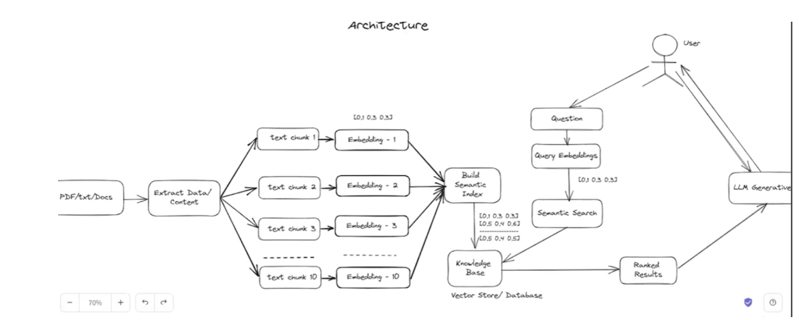

   # Document RAG System

   A robust Retrieval-Augmented Generation (RAG) system for document processing and querying using  Weaviate, and Ollama.

   ## System Architecture

   ### Components
   - **Flask API Server**: Handles HTTP requests and document uploads
   - **Celery Workers**: Manages asynchronous document processing
   - **Redis**: Message broker and result backend for Celery
   - **Weaviate**: Vector database for storing document embeddings
   - **Ollama**: Local LLM for generating embeddings

   ### Workflow
   1. Document Upload → Flask API
   2. Async Processing → Celery Worker
   3. Embedding Generation → Ollama
   4. Vector Storage → Weaviate
   5. Query Processing →  Weaviate
   6. Result Delivery → Flask API

   ## Architecture



   ## Setup Instructions

   ### Prerequisites
   - Docker and Docker Compose
   - Python 3.11+
   - Weaviate Cloud Account (or self-hosted instance)
   - 8GB+ RAM recommended

   ### Environment Setup
   1. Clone the repository:
      ```sh
      git clone <repository-url>
      cd document-rag-system
      ```
   2. Create a `.env` file with the following configuration:
      ```ini
      # Weaviate Configuration
      WEAVIATE_REST_URL=your-weaviate-url
      WEAVIATE_GRPC_URL=your-weaviate-grpc-url
      WEAVIATE_CLIENT_NAME=your-client-name
      WEAVIATE_ADMIN_API_KEY=your-api-key
      
      # Ollama Configuration
      OLLAMA_BASE_URL=http://localhost:11434
      OLLAMA_MODEL=llama3.1:latest
      
      # Redis Configuration
      REDIS_URL=redis://redis:6379/0
      
      # Document Processing
      CHUNK_SIZE=1000
      CHUNK_OVERLAP=200
      ```
   3. Start services:
      ```sh
      docker-compose up --build
      ```

## API Documentation

### Document Operations

#### 1. Upload Document
```http
POST /ingest
Content-Type: multipart/form-data

file: <document_file>
```
- Uploads a new document for processing
- Supports PDF, DOCX, JSON, and TXT formats
- Returns a task ID for tracking processing status

**Response:**
```json
{
    "task_id": "task-uuid",
    "status": "processing"
}
```

#### 2. Query Document
```http
POST /query
Content-Type: application/json

{
    "query": "your search query",
    "document_name": "document.pdf",
    "limit": 3,
    "similarity_threshold": 0.7,
    "include_metadata": true
}
```
- Performs semantic search within a specific document using RAG (Retrieval-Augmented Generation)
- Retrieves relevant text chunks based on semantic similarity
- Supports natural language queries
- Optional parameters:
  - `limit`: Maximum number of results to return (default: 3)
  - `similarity_threshold`: Minimum similarity score for results (default: 0.7)
  - `include_metadata`: Include document metadata in response (default: true)

**Response:**
```json
{
    "results": [
        {
            "content": "matching text chunk",
            "chunk_index": 1,
            "relevance_score": 0.95,
            "page_number": 1,
            "metadata": {
                "source": "document.pdf",
                "chunk_type": "text",
                "created_at": "2025-02-21T07:45:23Z"
            }
        }
    ],
    "document_info": {
        "documentId": "doc-uuid",
        "fileName": "document.pdf",
        "processed_at": "2025-02-20T14:44:41.376936",
        "chunk_count": "5",
        "total_pages": 10,
        "file_type": "pdf"
    },
    "query_stats": {
        "processing_time_ms": 156,
        "total_matches": 3
    }
}
```

**Error Responses:**
```json
// Document not found
{
    "error": "Document 'document.pdf' not found",
    "status": 404
}

// Invalid query
{
    "error": "Query string cannot be empty",
    "status": 400
}
```

#### 3. Check Processing Status
```http
GET /status/<task_id>
```
- Checks the status of a document processing task

**Response:**
```json
{
    "task_id": "task-uuid",
    "status": "completed",
    "result": true
}
```


  ## Design Choices and Trade-offs

### 1. Document Processing

**Choices:**
- Asynchronous processing using Celery
- Document chunking with configurable size and overlap
- Unique document IDs for proper isolation
- Metadata storage in Redis for fast retrieval

**Trade-offs:**
- Added complexity with distributed system
- Additional infrastructure requirements
- Potential for temporary inconsistency during processing

### 2. Vector Storage

**Choices:**
- Weaviate for vector storage and similarity search
- Custom schema with indexed properties
- Document-level filtering for precise results
- Metadata enrichment for better context

**Trade-offs:**
- Higher resource requirements
- More complex query construction
- Additional system dependency

### 3. Caching and Metadata

**Choices:**
- Redis for fast metadata access
- Separate storage for document info and vectors
- Filename to ID mapping for user-friendly interface

**Trade-offs:**
- Data duplication between stores
- Need for consistency management
- Additional memory usage

   ### Security Measures
   - Secure file handling
   - Input validation
   - Non-root Docker containers
   - Environment-based configuration
   - API key authentication

   ## Development

   ### Local Development Setup
   1. Create a virtual environment:
      ```sh
      python -m venv venv
      source venv/bin/activate  # Linux/Mac
      venv\Scripts\activate  # Windows
      ```
   2. Install dependencies:
      ```sh
      pip install -r requirements.txt
      ```
   3. Run services individually:
      ```sh
      # Terminal 1: Redis
      docker run -p 6379:6379 redis:alpine
      
      # Terminal 2: Ollama
      docker run -p 11434:11434 ollama/ollama
      
      # Terminal 3: Flask API
      python app.py
      
      # Terminal 4: Celery Worker
      celery -A tasks worker --pool=solo -l info
      ```
   4. Check API health:
      ```sh
      curl http://localhost:5000/health
      ```

   5. **Celery Tasks**
      - Check task status:
      ```sh
      curl http://localhost:5000/status/<task_id>
      ```

   6. **Memory Issues**
      - Increase Docker memory limit
      - Adjust chunk size in `.env`
      - Monitor Redis memory usage

   ### Performance Tuning

   1. **Document Processing**
      ```ini
      CHUNK_SIZE=1000  # Adjust based on document size
      CHUNK_OVERLAP=200  # Adjust for context preservation
      ```
   2. **Query Performance**
      - Use `limit` parameter in queries
      - Enable result streaming for large documents
      - Implement proper indexing in Weaviate


## Potential Improvements

1. **Scalability**
   - Implement batch processing for large documents
   - Add support for distributed vector storage
   - Optimize memory usage during processing

2. **Reliability**
   - Add retry mechanisms for failed tasks
   - Implement better error recovery
   - Add data consistency checks

3. **Features**
   - Support more document formats
   - Add document update capabilities
   - Implement cross-document search
   - Add user authentication and authorization

4. **Performance**
   - Optimize chunk size based on content
   - Implement caching for frequent queries
   - Add query result ranking improvements

## Error Handling

The system implements comprehensive error handling:
- Input validation for supported file types
- Processing status tracking
- Detailed error messages
- Automatic cleanup of failed processes

## Monitoring and Logging

- Detailed logging of all operations
- Performance metrics collection
- Processing status tracking
- Error reporting and monitoring
